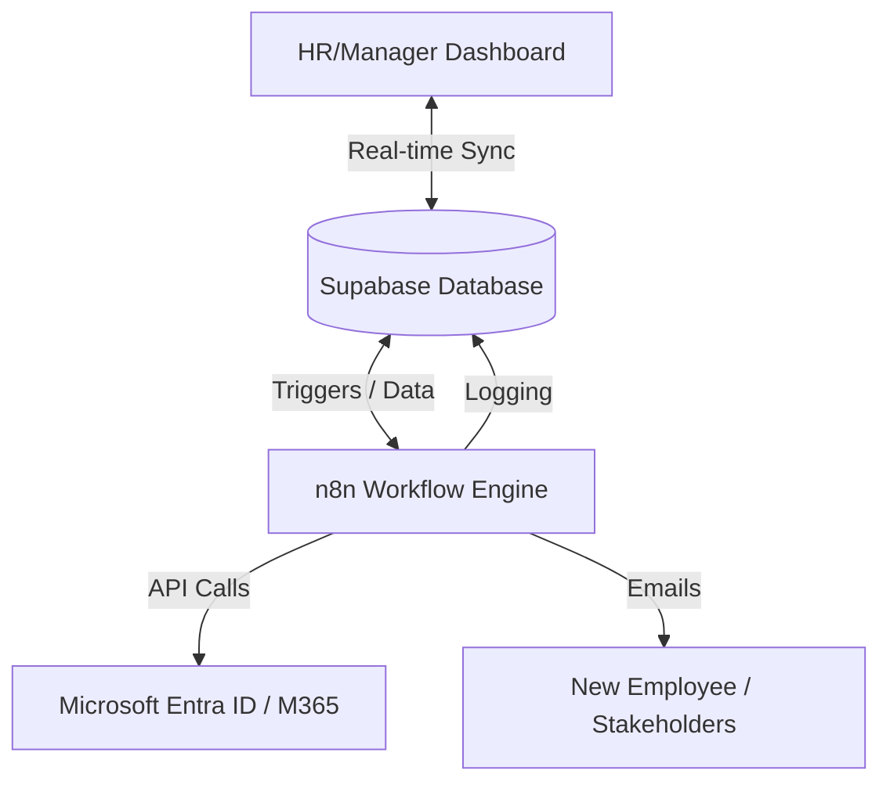
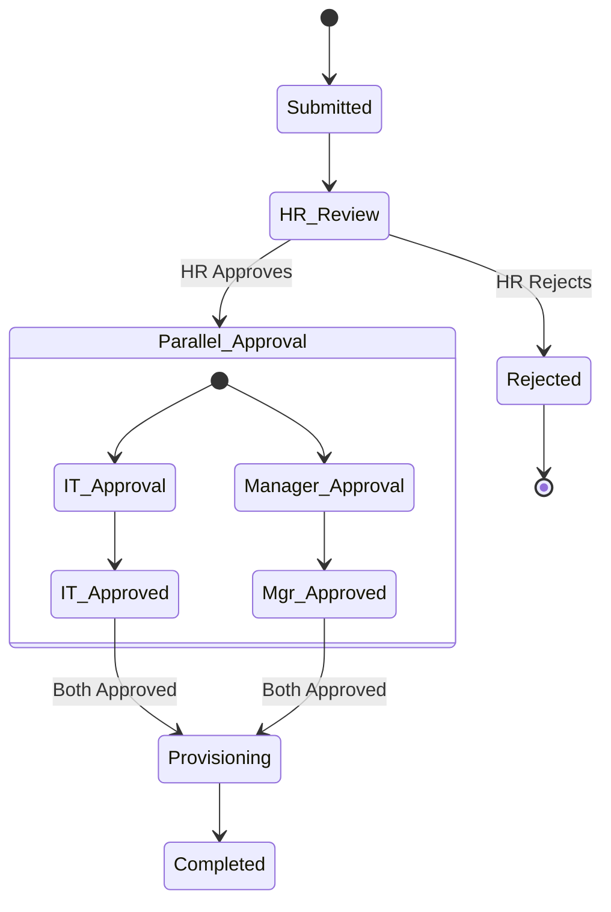

# System Architecture - Employee Onboarding

This document details the technical design, workflow logic, and data architecture of the Employee Onboarding Automation system.

## 🧱 High-Level Architecture

The system follows a decoupled architecture where the frontend (Dashboard) and backend logic (n8n) communicate through a shared data layer (Supabase).

## 🔄 Workflow Logic (n8n)

The core business logic is orchestrated by n8n. The "Employee Onboarding" workflow manages the entire lifecycle.

### 1. Intake & Validation
When a request is submitted via the dashboard or API, the workflow:
- Validates all required fields.
- Checks if the start date is at least 3 days in the future.
- Generates unique Employee and Request codes.

### 2. Approval Chain
The system employs a hybrid approval model:
- **Phase 1:** HR Approval (Sequential).
- **Phase 2:** Parallel Approval from both IT and the Department Manager.

### 3. Automated Provisioning
Upon final approval, the system executes:
- **Account Creation:** Generates corporate email and credentials.
- **Licensing:** Assigns M365 licenses based on the role.
- **Access Packages:** Grants access to department-specific apps and folders.

## 🗄️ Data Model (Supabase)

The database schema is designed for high relational integrity and auditability.

| Table | Description |
|-------|-------------|
| `employees` | Core employee profile and status. |
| `onboarding_requests` | Tracks the lifecycle of each onboarding instance. |
| `approval_steps` | Individual approval records linked to requests. |
| `provisioning_tasks` | Specific IT tasks (M365, Entra ID) and their outcomes. |
| `audit_log` | Immutable record of all system and user actions. |
| `departments` / `roles` | Reference data for organizational structure. |

## 🖼️ Workflow Visualizations

The following diagrams (available in `/screenshot`) represent the actual n8n implementation:

- **WF-01:** Main Onboarding Flow Overview.
- **WF-02:** Input Validation & Data Normalization logic.
- **WF-03:** HR Approval Stage details.
- **WF-04:** Parallel Approval orchestration.
- **WF-05:** IT Provisioning Sub-process.
- **WF-06:** Welcome Email & Final Completion logic.
- **WF-07:** Error Handling & Notification logic.
- **WF-08:** Audit Log & Status Update sub-flows.

## 🛡️ Security & Compliance
- **Auth:** Supabase Auth for dashboard access.
- **RLS:** Row Level Security ensures users only see data relevant to their role and department.
- **Secrets:** All API keys and credentials managed via n8n's encrypted credential store.
- **Auditability:** Every state change is timestamped and attributed to a user or system process.
