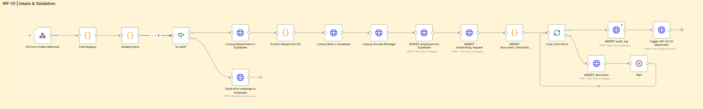

# Employee Onboarding Management Automation

An enterprise-grade, automated employee onboarding system powered by **n8n**, **Supabase**, and a **Real-time Web Dashboard**.



## 🚀 Overview

This Onboarding system automates the end-to-end journey of a new hire, from initial request submission to IT provisioning and final welcome. It eliminates manual overhead, ensures compliance through multi-stage approvals, and provides full transparency via a centralized dashboard.

## ✨ Key Features

- **Automated Workflow Orchestration:** Powered by n8n, managing complex logic, data lookups, and integrations.
- **Real-time Dashboard:** A responsive web portal for HR, IT, and Managers to track and approve requests.
- **Multi-Stage Approvals:** Built-in sequential and parallel approval chains (HR → IT & Manager).
- **Automated Provisioning:** Handles M365 licensing, account creation, and access package assignments.
- **Role-Based Access Control (RBAC):** Distinct permissions for Admin, HR, IT, and Manager roles.
- **Audit & Compliance:** Detailed logs of every action, status change, and system event.
- **Error Handling:** Robust error management with dedicated retry logic and logging.

## 🛠️ Tech Stack

- **Orchestration:** [n8n](https://n8n.io/)
- **Database & Auth:** [Supabase](https://supabase.com/) (PostgreSQL)
- **Frontend:** Vanilla JS, CSS3, HTML5
- **Integrations:** Microsoft Entra ID (Azure AD), M365, Email (SMTP/Exchange)

## 📁 Project Structure

```text
├── Dashboard/           # Vanilla JS Web Dashboard
│   ├── js/pages/        # Modular page logic (Overview, Requests, Approvals, etc.)
│   └── css/             # Responsive styling and themes
├── workflow/            # n8n Workflow JSON files
├── data/                # Database schema (CSV exports)
├── screenshot/          # Workflow visualizations and UI previews
└── marketing-material/  # Project planning and marketing docs
```

## ⚙️ Setup & Installation

### 1. Supabase Setup
- Create a new Supabase project.
- Run the schema migrations (refer to `/data` CSV structures or `Architecture.md` for table relationships).
- Enable Auth with Email provider.
- Set up RLS (Row Level Security) policies as defined in the dashboard logic.

### 2. n8n Workflow Configuration
- Import the JSON files from the `/workflow` directory into your n8n instance.
- Configure credentials for:
    - Supabase API
    - Microsoft Entra ID / M365
    - Email Service (SMTP)
- Update the environment variables/constants in the workflow to match your Supabase URL and keys.

### 3. Dashboard Deployment
- Update `Dashboard/js/config.js` with your Supabase URL and Anon Key.
- The dashboard can be hosted on any static site hosting (Vercel, Netlify, GitHub Pages).

## 📊 System Architecture

For a deep dive into the technical design, workflow logic, and data models, see [Architecture.md](./Architecture.md).

---
Developed by **Sonu Gupta**
